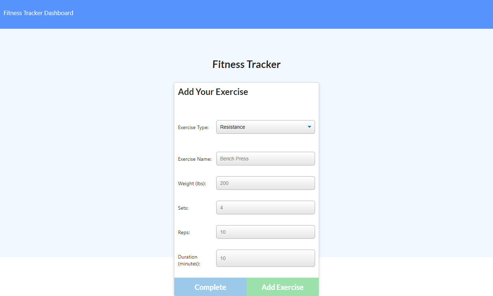

# Workout-Tracker

## Description 

An app to view, create, and track daily workouts. Users are able to log multiple exercises in a workout on a given day. The name, type, weight, sets, reps, and duration of exercise are logged. Statistics for the last 7 workouts workouts are available on the stats page. Built with MongoDB, Mongoose, Node and Express. 
Check out the app on Heroku: https://shielded-dusk-73422.herokuapp.com/

## Table of Contents

* [Installation](#installation)
* [Usage](#usage)
* [Credits](#credits)
* [License](#license)
* [Badges](#badges)

## Installation

Run 'npm i', 'node seeders/seed.js' then 'node server.js' from the command line to run the server. This app can be used without installation by visiting the Heroku site where it is deployed. https://shielded-dusk-73422.herokuapp.com/

## Usage 

Visit the homepage to view most recent workout, create a new workout, or add to the latest workout. 

## Credits

Sara Neves Pereira

## License

Copyright 2021 Lita Beach

Permission is hereby granted, free of charge, to any person obtaining a copy of this software and associated documentation files (the "Software"), to deal in the Software without restriction, including without limitation the rights to use, copy, modify, merge, publish, distribute, sublicense, and/or sell copies of the Software, and to permit persons to whom the Software is furnished to do so, subject to the following conditions:

The above copyright notice and this permission notice shall be included in all copies or substantial portions of the Software.

THE SOFTWARE IS PROVIDED "AS IS", WITHOUT WARRANTY OF ANY KIND, EXPRESS OR IMPLIED, INCLUDING BUT NOT LIMITED TO THE WARRANTIES OF MERCHANTABILITY, FITNESS FOR A PARTICULAR PURPOSE AND NONINFRINGEMENT. IN NO EVENT SHALL THE AUTHORS OR COPYRIGHT HOLDERS BE LIABLE FOR ANY CLAIM, DAMAGES OR OTHER LIABILITY, WHETHER IN AN ACTION OF CONTRACT, TORT OR OTHERWISE, ARISING FROM, OUT OF OR IN CONNECTION WITH THE SOFTWARE OR THE USE OR OTHER DEALINGS IN THE SOFTWARE.

## Badges

 
 
 

